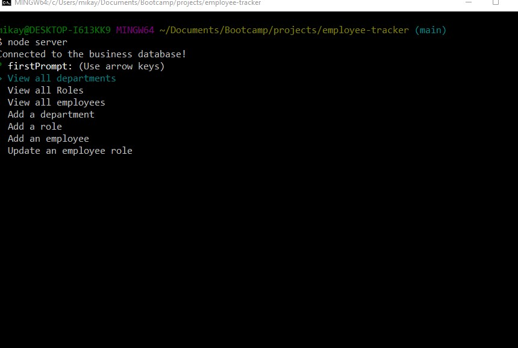
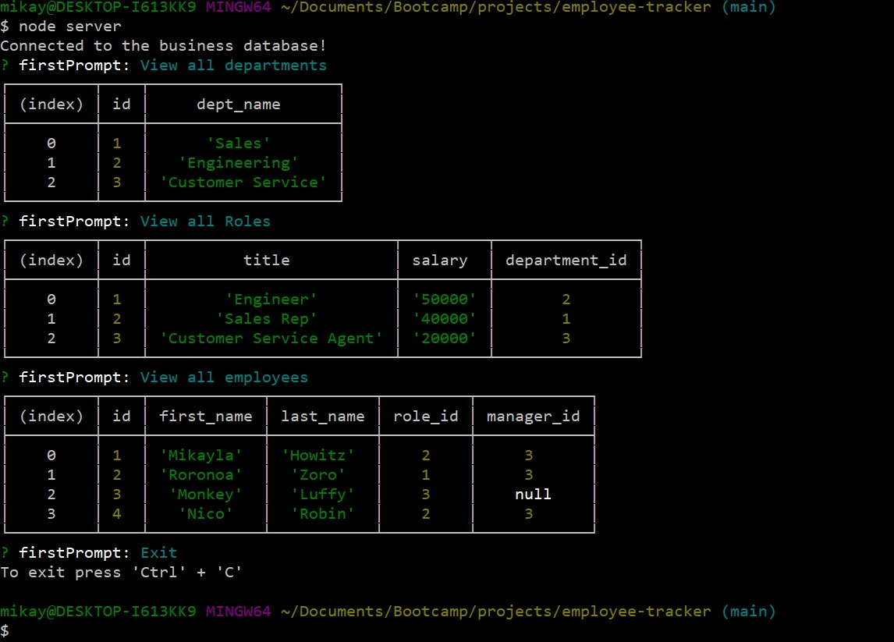

# employee-tracker
# Employee Database Command Line Application

Link to Repo: [GITHUB-REPO]https://github.com/mhowitz/employee-tracker

Link to Walkthrough Video: [VIDEO]https://youtu.be/DLflfRBWhwg

## Description

This Project was created using Node.js, the Inquirer package, and MySql2 for a user to create a MySql database of their employees, their job titles, and departments from the command line.

## Table of Contents

* [Installation](#installation)
* [Usage](#usage)
* [License](#license)
* [Contributing](#contributing)
* [Questions](#questions)

## Installation

Clone the GitHub repo to the user's computer. Be sure that node.js, the Inquirer package and MySql2 is installed to the local computer. Once everything is ready, run "node server" into the command line and promps will be displayed asking for user input.

## Usage

When the user runs the file, they are prompted with a list of options on how they would like to view or populate the database. 

Here is a screenshot of what the initial prompts look like:

Here is a screenshot of what a table will look like once it is populated: 

## License 

[MIT License Link]https://choosealicense.com/licenses/mit/

MIT License

Copyright (c) 2022 Mikayla Howitz

Permission is hereby granted, free of charge, to any person obtaining a copy of this software and associated documentation files (the "Software"), to deal in the Software without restriction, including without limitation the rights to use, copy, modify, merge, publish, distribute, sublicense, and/or sell copies of the Software, and to permit persons to whom the Software is furnished to do so, subject to the following conditions:

The above copyright notice and this permission notice shall be included in all copies or substantial portions of the Software.

THE SOFTWARE IS PROVIDED "AS IS", WITHOUT WARRANTY OF ANY KIND, EXPRESS OR IMPLIED, INCLUDING BUT NOT LIMITED TO THE WARRANTIES OF MERCHANTABILITY, FITNESS FOR A PARTICULAR PURPOSE AND NONINFRINGEMENT. IN NO EVENT SHALL THE AUTHORS OR COPYRIGHT HOLDERS BE LIABLE FOR ANY CLAIM, DAMAGES OR OTHER LIABILITY, WHETHER IN AN ACTION OF CONTRACT, TORT OR OTHERWISE, ARISING FROM, OUT OF OR IN CONNECTION WITH THE SOFTWARE OR THE USE OR OTHER DEALINGS IN THE SOFTWARE.

## Contributing
Eric Sayer T.A.
Karina T.A.

## Questions

Click [here](https://github.com/mhowitz) to visit my GitHub profile

Email for questions: miikaylahowitz@gmail.com

